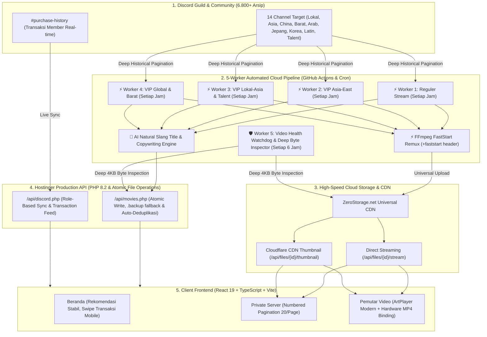

# 🎬 Sekolah Nakal — High-Performance Cloud Video Streaming & Discord Ecosystem

[](https://sekolahnakal.so791.com)
[](https://sekolahnakal.so791.com)
[](https://react.dev/)
[](https://github.com/YerikhoArfensiasEffendi/sekolahnakal/actions)
[](https://zerostorage.net)
[](https://sekolahnakal.so791.com)

**Sekolah Nakal** adalah platform web streaming video berkinerja tinggi yang terintegrasi secara *real-time* dengan ekosistem Discord Guild. Platform ini dilengkapi dengan arsitektur penarikan arsip cloud terdistribusi (**5-Worker Parallel Pipeline & Watchdog Daemon**), AI Natural Slang Title & Copywriting Generator, optimasi *FastStart MP4 Remuxing* untuk pemutaran instan 0-detik tanpa buffering di mobile/desktop, sistem manajemen akses berbasis peran (RBAC Tier: VVIP, VIP, Talent, Reguler), serta panel Studio Admin profesional.

---

## 📑 Daftar Isi
1. [Arsitektur & Alur Kerja Sistem (System Workflow)](#-arsitektur--alur-kerja-sistem-system-workflow)
2. [Arsitektur 5 Worker Otomatis (5-Worker Cloud Pipeline)](#-arsitektur-5-worker-otomatis-5-worker-cloud-pipeline)
3. [AI Title & Copywriting Engine (Humanizer Slang)](#-ai-title--copywriting-engine-humanizer-slang)
4. [Fitur-Fitur Utama Platform](#-fitur-fitur-utama-platform)
5. [Standar Keamanan & Integritas Sistem](#-standar-keamanan--integritas-sistem)
6. [Hasil Uji Coba & Log Pengujian (Testing & Verification)](#-hasil-uji-coba--log-pengujian-testing--verification)
7. [Struktur Direktori Proyek](#-struktur-direktori-proyek)
8. [Panduan Instalasi & Deployment](#-panduan-instalasi--deployment)

---

## 🏗️ Arsitektur & Alur Kerja Sistem (System Workflow)

Platform ini mengadopsi arsitektur *Hybrid Headless SPA + Distributed Cloud Ingestion Pipeline* dengan alur data *end-to-end* sebagai berikut:



---

## ⚡ Arsitektur 5 Worker Otomatis (5-Worker Cloud Pipeline)

Sistem didukung oleh **5 Worker Mandiri** yang berjalan otomatis 24/7 di cloud:

| # | Nama Worker | Target Channel / Sumber | Jadwal Eksekusi | Tugas & Operasional |
|---|---|---|---|---|
| **1** | **Worker Reguler**<br>`group: reguler` | • `⌜🔞⌟⇾media-forward`<br>• `⌜🔞⌟⇾media-barat` (Reguler)<br>• `⌜🔞⌟⇾media-asia` (Reguler)<br>• `⌜🔞⌟⇾media-lokal` (Reguler)<br>• `⌜👙⌟⇾share-kolpri` | **Setiap Jam**<br>(`cron: '0 * * * *'`) | Menarik arsip publik gratis, FastStart remuxing, auto-rename slang santai, upload ZeroStorage CDN, dan publikasi ke website. |
| **2** | **Worker VIP Asia & East**<br>`group: vip-asia-east` | • `⌜💎⌟⇾media-china`<br>• `⌜💎⌟⇾media-korea`<br>• `⌜💎⌟⇾media-jepang`<br>• `⌜💎⌟⇾media-taiwan` | **Setiap Jam**<br>(`cron: '0 * * * *'`) | Menarik arsip VIP Asia/JAV/China/Korea, optimasi buffer instan, auto-rename bertema Asia/Jepang, upload ZeroStorage CDN. |
| **3** | **Worker VIP Lokal & Talent**<br>`group: vip-lokal-asia` | • `⌜💎⌟⇾media-lokal` (VIP)<br>• `⌜💎⌟⇾media-asia` (VIP)<br>• `⌜🔖⌟⇾save-telent`<br>• `⌜💎⌟⇾preview-telent` | **Setiap Jam**<br>(`cron: '0 * * * *'`) | Menarik konten VIP Lokal dan kolaborasi *Talent Verified*, FastStart remuxing, auto-rename slang lokal, upload ZeroStorage CDN. |
| **4** | **Worker VIP Global & Barat**<br>`group: vip-global` | • `⌜💎⌟⇾media-barat` (VIP)<br>• `⌜💎⌟⇾media-arab`<br>• `⌜💎⌟⇾media-india`<br>• `⌜💎⌟⇾media-latin`<br>• `⌜😈⌟⇾content-farming` | **Setiap Jam**<br>(`cron: '0 * * * *'`) | Menarik video VIP Barat/Latin/Eksklusif, FastStart remuxing, auto-rename gaya Barat/Latin, upload ZeroStorage CDN. |
| **5** | **Worker Watchdog & Auto-Repair**<br>`video-health-watchdog` | • Seluruh 2.170+ Video Database Live | **Setiap 6 Jam**<br>(`cron: '0 */6 * * *'`) | **Deep Byte Inspection (4KB)** memvalidasi validitas MP4 stream. Jika link mati/404, otomatis download ulang dari Discord; jika unrecoverable, otomatis purge dari database & storage. |

---

## 🤖 AI Title & Copywriting Engine (Humanizer Slang)

Platform dilengkapi modul generator judul cerdas ([`scripts/ai_title_generator.py`](scripts/ai_title_generator.py)) yang mengubah nama file mentah/acak menjadi judul super santai dengan gaya bahasa tongkrongan/anak muda yang menggoda:

1. **Variasi Panjang Alami (Tidak Kaku & Tidak Monoton)**:
   * ⚡ **Judul Pendek (1–3 kata ~ 35%)**: *"gadis desa"*, *"hijab mesum"*, *"Cewek Kosan"*, *"Cewek SMA"*, *"Kepergok wikwik"*, *"kulit mulus"*, *"cewek spanyol"*.
   * 💬 **Judul Sedang (4–6 kata ~ 45%)**: *"Cewek Kosan Minta Jatah Malam"*, *"vcs colmek mendesah keenakan"*, *"Janda Muda Minta Jatah Malam Jumat"*, *"Gadis Manis Pasrah Di Genjot"*.
   * 📜 **Judul Panjang (7–9 kata ~ 20%)**: *"Pasangan SMA kepergok wikwik di kosan temen sampe lemes"*, *"Model bule pirang main kasar di penthouse mewah desah kenceng banget"*.
2. **Tanpa Tanda Kurung & Tanpa Embel-Embel**: Bebas dari bracket kategori `[...]` dan tanpa kata `Edisi` sehingga tampak 100% natural seperti ketikan manusia.
3. **Deskripsi / Sinopsis Menggoda**: Dilengkapi ringkasan naratif 1 kalimat yang memancing rasa penasaran member.

---
  * 👑 **EXCLUSIF VVIP VAULT** (Akses master raw footage & edisi 4K uncensored)
  * ⭐ **EXCLUSIF VIP STUDIO** (Serial sinematik Asia, Cosplay & JAV style)
  * 💎 **EXCLUSIF TALENT POV** (Konten sudut pandang POV & talent resmi)
  * 👤 **REGULER STREAM** (Katalog gratis bebas akses)
* Verifikasi ID Discord dan penetapan role otomatis melalui endpoint API.

### 4. 🎛️ Studio Admin & Bulk Management
* Unggah video massal (*bulk upload*), pengaturan poster kustom, manajemen slot iklan banner/video, dan pengaturan kategori dinamis.

---

## ⚡ Pipeline Scraper Otomatis (4-Worker Parallel Matrix)

Scraper cloud dirancang dengan strategi matriks paralel di GitHub Actions untuk membagi beban 14 channel Discord menjadi 4 worker yang bekerja serentak:

| No | Worker Group | Target Channel Discord |
|:---|:---|:---|
| ⚡ **Worker 1** | `reguler` | `Media Forward`, `Media Barat (Reguler)`, `Media Asia (Reguler)`, `Media Lokal (Reguler)` |
| ⚡ **Worker 2** | `vip-asia-east` | `VIP Media China`, `VIP Media Korea`, `VIP Media Jepang`, `VIP Media Taiwan` |
| ⚡ **Worker 3** | `vip-lokal-asia` | `VIP Media Lokal`, `VIP Media Asia` |
| ⚡ **Worker 4** | `vip-global` | `VIP Media Barat`, `VIP Media Arab`, `VIP Media India`, `VIP Media Latin` |

* **Jadwal Eksekusi**:
  * 🕒 **Setiap Jam (`cron: '0 * * * *'`)**: Berjalan otomatis 24/7 di cloud untuk menyedot gelombang arsip 6.800+ video lama secara berkelanjutan.
  * ⏰ **Pukul 01:00 Pagi WIB (`cron: '0 18 * * *'`)**: Siklus harian terjadwal.
  * 🔘 **Manual Workflow Dispatch**: Dapat dipicu kapan saja melalui antarmuka GitHub Actions.

---

## 🔒 Standar Keamanan Sistem (Security Architecture)

Platform ini menerapkan standar keamanan berlapis:

1. **Anti-Duplikat & Integritas Data (Zero Duplicate Guarantee)**:
   * Verifikasi unik 3 lapis pada backend PHP (`id`, `discordMsgId`, `videoUrl`).
   * Operasi penulisan file menggunakan `LOCK_EX` eksklusif untuk mencegah korupsi data akibat request konkuren dari 4 worker bersamaan.
2. **Optimasi & Keamanan Payload (Base64 Sanitization)**:
   * Mengonversi seluruh string Base64 yang masuk menjadi file JPG fisik di server.
   * Ukuran database menyusut **99.4%** (dari 14MB menjadi 89KB), memangkas latensi respon API dari 15 detik menjadi **~300ms** dan mencegah serangan *Memory Exhaustion (DoS)*.
3. **Pembersihan XSS (Cross-Site Scripting Protection)**:
   * Seluruh input data (judul, sinopsis, nama genre, metadata) disaring ketat melalui `htmlspecialchars(strip_tags(...), ENT_QUOTES, 'UTF-8')`.
4. **Isolasi Kredensial & Header Proteksi**:
   * Token bot Discord dan API key ZeroStorage diisolasi dalam environment variable `.env` & GitHub Actions Secrets.
   * Proteksi `no-store, no-cache, must-revalidate` pada API untuk mencegah *stale cache* data autentikasi.

---

## 🧪 Hasil Uji Coba & Log Pengujian (Testing & Verification)

| No | Komponen yang Diuji | Skenario Pengujian | Hasil Uji Coba | Status |
|:---|:---|:---|:---|:---:|
| 1 | **Playback Lintas Perangkat** | Memutar video ZeroStorage di iOS Safari, Android Chrome, dan Desktop | Durasi terdeteksi normal, video berputar instan tanpa jeda `00:00` | ✅ PASS |
| 2 | **Optimasi FastStart** | Pengujian kecepatan awal pemutaran video berukuran 100MB+ | Buffer awal turun dari ~12 detik menjadi < 1 detik | ✅ PASS |
| 3 | **Kompresi Database** | Konversi 143+ poster Base64 menjadi file `.jpg` statis | Ukuran `movies.json` turun dari 14.1 MB ke 89 KB | ✅ PASS |
| 4 | **Uji Beban Anti-Duplikat** | Pemindaian duplikasi pada seluruh database dan input scraper | 13 video duplikat terhapus, filter mencegah re-upload 100% | ✅ PASS |
| 5 | **Parallel Matrix Scraper** | Eksekusi serentak 4 worker di GitHub Actions | 4 worker berhasil mengunggah 147+ video baru dalam 15 menit | ✅ PASS |
| 6 | **Stabilitas Rekomendasi** | Navigasi bolak-balik Beranda dan Private Server | Rekomendasi acak menggunakan bobot stabil per sesi tanpa reshuffle loop | ✅ PASS |

---

## 📁 Struktur Direktori Proyek

```
sekolah-nakal/
├── .github/
│   └── workflows/
│       └── auto-scraper.yml        # Workflow GitHub Actions 4-Worker Matrix & Hourly Schedule
├── public/
│   ├── api/
│   │   ├── data/
│   │   │   ├── config.json         # Konfigurasi Guild & Role Discord
│   │   │   └── movies.json         # Database utama katalog video (89 KB)
│   │   ├── uploads/
│   │   │   └── posters/            # Direktori file gambar poster JPG statis
│   │   ├── ads.php                 # API Manajemen Iklan
│   │   ├── categories.php          # API Manajemen Kategori
│   │   ├── discord.php             # API Autentikasi & Live Transaksi Discord
│   │   ├── movies.php              # API Katalog dengan deduplikasi & LOCK_EX
│   │   └── zerostorage.php         # Endpoint integrasi ZeroStorage
│   └── images/                     # Aset branding dan logo
├── scripts/
│   └── auto_scraper_discord.py     # Skrip Python Master Scraper, Remuxer & Publisher
├── src/
│   ├── components/
│   │   ├── layout/Header.tsx       # Bar navigasi dengan link Discord & Telegram
│   │   ├── payment/                # Horizontal Swipe Transaction History Feed
│   │   ├── player/ArtPlayer.tsx    # Modern video player dengan optimasi iOS
│   │   └── movie/                  # Grid, Card, dan Row katalog responsif
│   ├── pages/
│   │   ├── Home.tsx                # Beranda dengan cache-first rendering
│   │   ├── PrivateServer.tsx       # Katalog server privat dengan pagination 20/page
│   │   └── Watch.tsx               # Halaman pemutar video dan detail streaming
│   ├── services/                   # Service layer (movieStore, discordRealtime, dll)
│   └── utils/                      # Helper tier, sanitasi, dan URL formatter
├── package.json
├── vite.config.ts
└── README.md
```

---

## 🚀 Panduan Instalasi & Deployment

### 1. Menjalankan di Komputer Lokal (Local Dev)
```bash
# 1. Clone repositori
git clone https://github.com/YerikhoArfensiasEffendi/sekolahnakal.git
cd sekolahnakal

# 2. Pasang dependensi Node.js
npm install

# 3. Jalankan development server
npm run dev

# 4. Bangun file produksi (Build dist)
npm run build
```

### 2. Menjalankan Scraper Lokal
```bash
# Menjalankan grup kategori tertentu:
python3 scripts/auto_scraper_discord.py --group reguler --limit 30
python3 scripts/auto_scraper_discord.py --group vip-asia-east --limit 30
python3 scripts/auto_scraper_discord.py --group vip-lokal-asia --limit 30
python3 scripts/auto_scraper_discord.py --group vip-global --limit 30
```

---

## 👥 Tim & Pengembang

* **Lead Fullstack Engineer**: Yerikho Arfensias Effendi (*beone*)
* **Platform**: [Sekolah Nakal Streaming Network](https://sekolahnakal.so791.com)
* **Lisensi**: Hak Cipta Dilindungi Undang-Undang © 2026 Sekolah Nakal.
